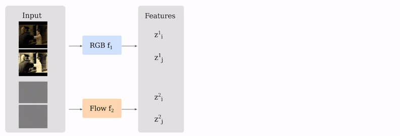
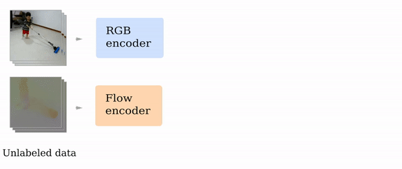
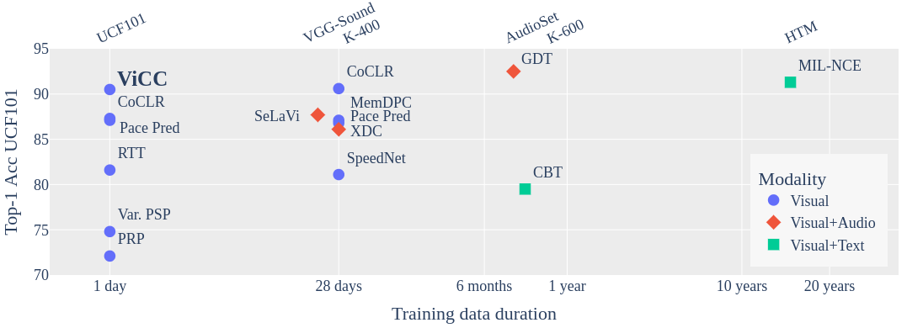

# Self-supervised Video Representation Learning with Cross-Stream Prototypical Contrasting

[](https://paperswithcode.com/sota/self-supervised-video-retrieval-on-hmdb51?p=self-supervised-video-representation-learning-7)
[](https://paperswithcode.com/sota/self-supervised-video-retrieval-on-ucf101?p=self-supervised-video-representation-learning-7)
[](https://paperswithcode.com/sota/self-supervised-action-recognition-on-ucf101-1?p=self-supervised-video-representation-learning-7)
[](https://paperswithcode.com/sota/self-supervised-action-recognition-on-ucf101?p=self-supervised-video-representation-learning-7)

This repository provides the implementation of the WACV 2022 paper: [Self-supervised Video Representation learning with Cross-stream Prototypical Contrasting](https://openaccess.thecvf.com/content/WACV2022/html/Toering_Self-Supervised_Video_Representation_Learning_With_Cross-Stream_Prototypical_Contrasting_WACV_2022_paper.html)  

[WACV22 Open Access](https://openaccess.thecvf.com/content/WACV2022/html/Toering_Self-Supervised_Video_Representation_Learning_With_Cross-Stream_Prototypical_Contrasting_WACV_2022_paper.html)  
[Arxiv link](https://arxiv.org/abs/2106.10137)  

## Video Cross-Stream Prototypical Contrasting (ViCC)

We leverage both optical flow and RGB as views for contrastive learning, by predicting consistent stream prototype assignments from the views in the training of each model. This effectively transfers knowledge from motion (flow) to appearance (RGB).



### Training process

In one alternation, we optimize one model and the corresponding prototypes. The method consists of two stages. In Single-stream, RGB and Flow encoder are trained on their
own features. In Cross-stream, both models are trained on both feature types. 

<p align="center">

</p>

### Results

<center>
    
Nearest-neighbour video retrieval results on UCF101:
    
| **Model**  |   **R@1**   |
| :---   |  :---:  |
| ViCC-RGB-2    |  62.1   |
| ViCC-Flow-2  |  59.7   |
| ViCC-R+F-2  |  65.1   |
    
</center>

Results on end-to-end finetuning for action recognition:



### News

* Pretrained models are now available (2021-08-24)

### References

* [CoCLR: Self-supervised Co-Training for Video Representation Learning, Han et al.](https://github.com/TengdaHan/CoCLR)
* [SwAV: Unsupervised Learning of Visual Features by Contrasting Cluster Assignments, Caron et al.](https://github.com/facebookresearch/swav)

## How to run the code

### Get started 

#### Requirements

* Python 3.6
* PyTorch==1.4.0, torchvision 0.5.0
* Cuda 10.1
* Apex with cuda extension (see also: [this issue](https://github.com/facebookresearch/swav/issues/18#issuecomment-748123838))
* See [environment file](https://github.com/martinetoering/ViCC/tree/master/environment.yml). => tqdm, pandas, python-lmdb 0.98, mgspack==1.0.0, msgpack-python==0.5.6.

#### Preprocessing

Follow instructions in [process_data](https://github.com/martinetoering/ViCC/tree/master/src/process_data/readme.md). <br >
Optional: See [CoCLR](https://github.com/TengdaHan/CoCLR) for dataset. (last checked: 2021-07-03)

#### Pretrain and Evaluation

We provide several [slurm scripts](https://github.com/martinetoering/ViCC/tree/master/slurm_scripts) for pretraining, as well as for linear probe, retrieval and finetuning experiments. Your own paths can be changed in the scripts. <br > Distributed Training is available via Slurm where the distributed initialization method needs to be set correctly (parameter <code>dist_url</code>).

### How to run: pretraining

The algorithm consist of two stages (following [CoCLR](https://github.com/TengdaHan/CoCLR)):
* **Single-stream**: RGB model is trained on RGB data, then Flow on flow data. 
* **Cross-stream**: Both models are initialized with single-stream models. RGB is trained on both RGB and Flow data, then Flow is trained on RGB and Flow data. Repeat for N alternations.

#### Single-stream

Train ViCC-RGB-1 (Single-stream):
```
sbatch slurm_scripts/pretrain/single-rgb.sh
```
_or:_

`cd src`

```
CUDA_VISIBLE_DEVICES=0,1,2,3 python -m torch.distributed.launch \
--nproc_per_node=4 main_single.py --net s3d --model vicc --dataset ucf101-2clip \
--seq_len 32 --num_seq 2 --ds 1 --batch_size 48 --wd 1e-6 --cos True \
--base_lr 0.6 --final_lr 0.0006 \
--epochs 500 --save_epoch 199 --optim sgd --img_dim 128 \
--dataset_root {DATASET_PATH} --prefix {EXPERIMENT_PATH} --name_prefix "single/rgb" \
--workers 12 --moco-dim 128 --moco-k 1920 --moco-t 0.1 \
--views_for_assign 0 1 --nmb_views 2 --epsilon 0.05 --sinkhorn_iterations 3 \
--nmb_prototypes 300 --epoch_queue_starts 200 --freeze_prototypes_nepochs 100 --use_fp16 False 
``` 
Train ViCC-Flow-1 (Single-stream):
```
sbatch slurm_scripts/pretrain/single-flow.sh
```
_or:_

`cd src`

```
CUDA_VISIBLE_DEVICES=0,1,2,3 python -m torch.distributed.launch \
--nproc_per_node=4 main_single.py --net s3d --model vicc --dataset ucf101-f-2clip \
--seq_len 32 --num_seq 2 --ds 1 --batch_size 48 --wd 1e-6 --cos True \
--base_lr 0.6 --final_lr 0.0006 \
--epochs 500 --save_epoch 199 --optim sgd --img_dim 128 \
--dataset_root {DATASET_PATH} --prefix {EXPERIMENT_PATH} --name_prefix "single/flow" \
--workers 12 --moco-dim 128 --moco-k 1920 --moco-t 0.1 \
--views_for_assign 0 1 --nmb_views 2 --epsilon 0.05 --sinkhorn_iterations 3 \
--nmb_prototypes 300 --epoch_queue_starts 200 --freeze_prototypes_nepochs 100 --use_fp16 False 
```

#### Cross-stream

Train ViCC-RGB-2 and ViCC-Flow-2:
```
sbatch slurm_scripts/pretrain/cross.sh
```
_or:_

`cd src`

Cycle 1 RGB:
```
CUDA_VISIBLE_DEVICES=0,1,2,3 python -m torch.distributed.launch \
--nproc_per_node=4 main_cross.py --net s3d --model 'vicc2' --dataset 'ucf101-2stream-2clip' \
--seq_len 32 --num_seq 2 --ds 1 --batch_size 24 --wd 1e-6 --cos True \
--base_lr 0.6 --final_lr 0.0006 --pretrain {ViCC-RGB-1-SINGLE.pth.tar} {ViCC-Flow-1-SINGLE.pth.tar} \
--epochs 100 --save_epoch 24 --optim sgd --img_dim 128 \
--dataset_root {DATASET_PATH} --prefix {EXPERIMENT_PATH} --name_prefix "cross/c1-flow-mining" \
--workers 12 --moco-dim 128 --moco-k 1920 --moco-t 0.1 \
--views_for_assign 0 1 2 3 --nmb_views 2 2 --epsilon 0.05 --sinkhorn_iterations 3 \
--nmb_prototypes 300 --epoch_queue_starts 25 --freeze_prototypes_nepochs 0 --use_fp16 True \
``` 
Cycle 1 Flow (notice the `reverse` argument):
```
CUDA_VISIBLE_DEVICES=0,1,2,3 python -m torch.distributed.launch \
--nproc_per_node=4 main_cross.py --net s3d --model 'vicc2' --dataset 'ucf101-2stream-2clip' \
--seq_len 32 --num_seq 2 --ds 1 --batch_size 24 --wd 1e-6 --cos True \
--base_lr 0.6 --final_lr 0.0006 --pretrain {ViCC-Flow-1-SINGLE.pth.tar} {ViCC-RGB-2-CYCLE-1.pth.tar}  \
--epochs 100 --save_epoch 24 --optim sgd --img_dim 128 \
--dataset_root {DATASET_PATH} --prefix {EXPERIMENT_PATH} --name_prefix "cross/c1-rgb-mining" \
--workers 12 --moco-dim 128 --moco-k 1920 --moco-t 0.1 \
--views_for_assign 0 1 2 3 --nmb_views 2 2 --epsilon 0.05 --sinkhorn_iterations 3 \
--nmb_prototypes 300 --epoch_queue_starts 25 --freeze_prototypes_nepochs 0 --use_fp16 True \
--reverse \
``` 

Repeat the above two commands for the second cycle (Cycle 2 RGB, Cycle 2 Flow) with the newest checkpoints every run.

### How to run: evaluation

Use e.g. `sbatch slurm_scripts/eval/retr-rgb-2.sh`, `sbatch slurm_scripts/eval/lin-rgb-2.sh` or `sbatch slurm_scripts/eval/ft-rgb-2.sh`. The '2' in the name of the scripts indicates the models for the cross-stream stage, but single-stream models could also be evaluated in the same way.

_or_:

`cd src/eval`

#### Nearest-neighbour video retrieval

For RGB:
```
CUDA_VISIBLE_DEVICES=0,1 python main_classifier.py --net s3d --dataset ucf101 \
--seq_len 32 --ds 1 --retrieval \
--dirname {FEATURE_PATH} --test {TEST_PATH} --dataset_root {DATASET_PATH}
``` 
Use `--dataset 'ucf101-f'` argument for flow.

#### Linear probe

For RGB, e.g.:
```
CUDA_VISIBLE_DEVICES=0,1,2,3 python main_classifier.py --net 's3d' --dataset 'ucf101' \
--seq_len 32 --ds 1 --batch_size 32 --train_what last --optim sgd --lr 1e-1 --wd 1e-3 \
--epochs 100 --schedule 60 80 --name_prefix "lin-rgb-2" \
--prefix {EXPERIMENT_PATH} --pretrain {PRETRAIN_PATH} --dataset_root {DATASET_PATH} 
```
Use `--dataset 'ucf101-f'` argument for flow.

Test linear probe:
```
CUDA_VISIBLE_DEVICES=0,1,2,3 python main_classifier.py --net s3d --dataset 'ucf101' \
--batch_size 32 --seq_len 32 --ds 1 --train_what last --ten_crop \
--prefix {EXPERIMENT_PATH} --test {TEST_PATH} --dataset_root {DATASET_PATH}
```
#### End-to-end finetuning

For RGB, e.g.:
```
CUDA_VISIBLE_DEVICES=0,1,2,3 python main_classifier.py --net 's3d' --dataset 'ucf101' \
--seq_len 32 --ds 1 --batch_size 32 --train_what ft --optim sgd --lr 0.1 --wd 0.001 \
--epochs 500 --schedule 200 300 400 450 --name_prefix "ft-rgb-2" \
--prefix {EXPERIMENT_PATH} --pretrain {PRETRAIN_PATH} --dataset_root {DATASET_PATH}
```
Use `--dataset 'ucf101-f'` argument for flow.

Test finetuning:
```
CUDA_VISIBLE_DEVICES=0,1,2,3 python main_classifier.py --net s3d --dataset 'ucf101' \
--batch_size 32 --seq_len 32 --ds 1 --train_what ft --ten_crop \
--prefix {EXPERIMENT_PATH} --test {TEST_PATH} --dataset_root {DATASET_PATH}
```

<!-- ## Questions

If you have questions, please create a GitHub issue or send an email to <martine.toering@gmail.com>.

 -->
 
## Pretrained models

* [ViCC-RGB](https://drive.google.com/file/d/1t2PhhRpo4LPO_ug5-0iuPT2zhfq-lB94/view?usp=sharing) 
* [ViCC-Flow](https://drive.google.com/file/d/1G22SYmGJ8Ybvg-RU9ZWTVjZE9wx8u8Ov/view?usp=sharing)

Single-stream:
* [ViCC-RGB-Single-stream](https://drive.google.com/file/d/13mHTqnc-fkpm6_OpLbgJZg-m2Xf62e96/view?usp=sharing)
* [ViCC-Flow-Single-stream](https://drive.google.com/file/d/1fx8lUDj_GvF5RK53HWODbn9OcM6QnoUb/view?usp=sharing)


## Citation

If you find this repository helpful in your research, please consider citing our paper:

```
@article{toering2021selfsupervised,
    title={Self-supervised Video Representation Learning with Cross-Stream Prototypical Contrasting}, 
    author={Martine Toering and Ioannis Gatopoulos and Maarten Stol and Vincent Tao Hu},
    journal={Proceedings of the IEEE/CVF Winter Conference on Applications of Computer Vision (WACV)},
    year={2022}
}
```

## Acknowledgements
This work was supported and funded from the [University of Amsterdam](https://www.uva.nl/), and [BrainCreators B.V.](https://braincreators.com/).

**Author** <br >
Martine Toering, 2021

